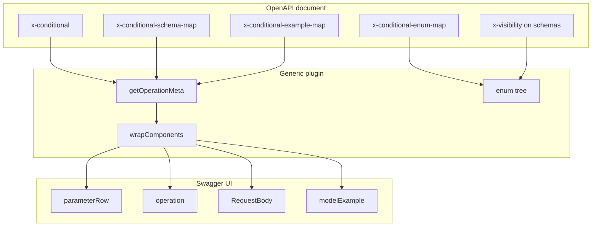

# Developer guide

How **swagger-ui-generic-conditional-visibility-plugin** is built, how Swagger UI plugins work in general, and how to extend or debug this implementation.

**Specification for API authors:** [docs/EXTENSION-CONTRACT.md](./docs/EXTENSION-CONTRACT.md)  
**Copy-paste patterns:** [docs/EXAMPLES.md](./docs/EXAMPLES.md)

---

## Table of contents

1. [Design goals](#1-design-goals)
2. [Architecture](#2-architecture)
3. [Plugin factory and configuration](#3-plugin-factory-and-configuration)
4. [Build pipeline](#4-build-pipeline)
5. [Core algorithms](#5-core-algorithms)
6. [Component wrappers](#6-component-wrappers)
7. [Redux state](#7-redux-state)
8. [OpenAPI integration](#8-openapi-integration)
9. [Parameter I/O](#9-parameter-io)
10. [Request body pipeline](#10-request-body-pipeline)
11. [Adding features](#11-adding-features)
12. [Testing and debugging](#12-testing-and-debugging)
13. [Extension naming and migration](#13-extension-naming-and-migration)
14. [Further reading](#14-further-reading)

---

## 1. Design goals

| Goal | Implementation |
|------|----------------|
| Domain-neutral extensions | `x-conditional-*` (configurable via `extensionNames`) |
| N-level hierarchy | Ordered `selectors` array, any length |
| Any parameter location | `in: path \| query \| header` per selector |
| Opt-in per operation | Only operations with `x-conditional` are wrapped |
| Predictable map keys | `keyJoin` + optional `leafKeyOnly` |
| No webpack requirement | Single `plugin.js` + Node IIFE wrap |

Non-goals (v1): cookie params, form fields inside body, async enum loading, expression language for conditions.

---

## 2. Architecture



### File map

| File | Responsibility |
|------|----------------|
| `src/plugin.js` | Entire plugin: config, spec parsing, wrappers, styles |
| `scripts/build.mjs` | IIFE bundle → `dist/generic-conditional-visibility-plugin.js` |

---

## 3. Plugin factory and configuration

```javascript
function GenericConditionalVisibilityPlugin(userConfig) {
  const cfg = { ...defaults, ...userConfig };
  // closures use cfg
  return { statePlugins, wrapComponents, afterLoad };
}
```

### Registration patterns

```javascript
// Default config
plugins: [SwaggerUIGenericConditionalVisibilityPlugin]

// Explicit factory (recommended when passing config)
plugins: [() => SwaggerUIGenericConditionalVisibilityPlugin({ keyJoin: "::" })]
```

Swagger UI invokes each plugin entry as a function that **returns** the plugin object. The outer `GenericConditionalVisibilityPlugin` is that factory.

### Config options

| Option | Type | Default | Description |
|--------|------|---------|-------------|
| `extensionNames.conditional` | string | `x-conditional` | Operation extension |
| `extensionNames.enumMap` | string | `x-conditional-enum-map` | Enum tree |
| `extensionNames.schemaMap` | string | `x-conditional-schema-map` | Key → schema name |
| `extensionNames.exampleMap` | string | `x-conditional-example-map` | Key → example |
| `extensionNames.visibility` | string | `x-visibility` | Schema extension |
| `keyJoin` | string | `\|` | Composite key separator |
| `leafKeyOnly` | boolean | `false` | Map keys use last selector only |
| `pluginKey` | string | `genericConditionalVisibility` | Redux slice name |
| `stylesId` | string | `swagger-ui-gcv-styles` | Injected `<style>` id |

Redux actions are exposed as `{pluginKey}Actions` (e.g. `genericConditionalVisibilityActions`). A duplicate slice `genericConditionalVisibility` is registered for stable naming.

---

## 4. Build pipeline

```bash
npm run build   # node scripts/build.mjs
npm run clean   # rm -rf dist
```

The build:

1. Reads `src/plugin.js` as text (no transpilation).
2. Wraps it in UMD-style IIFE.
3. Assigns `global.SwaggerUIGenericConditionalVisibilityPlugin = factory`.
4. The inner file must define `GenericConditionalVisibilityPlugin` and the IIFE returns it.

**Why no bundler?** The plugin uses only `system.React` and `system.Im` from Swagger UI—no npm dependencies at runtime.

### Publishing

Publish `dist/generic-conditional-visibility-plugin.js` or let consumers copy from `dist/` after `npm run build`. Source lives in `src/plugin.js`.

---

## 5. Core algorithms

### 5.1 Parsing selectors

`parseSelectorDefs(conditional)` normalizes:

- `"a,b,c"` → `[{name:a,in:path}, ...]`
- `["a","b"]` → path only
- `[{name, in}]` → full defs

### 5.2 Enum tree

**Explicit:** `operation[x-conditional-enum-map]` must follow the nested shape documented in [EXTENSION-CONTRACT.md](./docs/EXTENSION-CONTRACT.md).

**Derived:** `buildEnumTreeFromSchemas` walks `components.schemas[*].x-visibility.when` and nests by selector order.

### 5.3 Options at level i

```
node := tree
for j in 0 .. i-1:
  node := node[selector[j].name][selection[selector[j].name]]
options := keys or array at node[selector[i].name]
```

If empty, derive candidates from `schemaMap` keys sharing the prefix from `selectionKey(selection, selectors[0..i-1])`.

### 5.4 Selection key

```javascript
selectionKey = selectorDefs
  .map(d => selection[d.name])
  .filter(Boolean)
  .join(keyJoin);
```

With `leafKeyOnly`, only `selection[lastSelector.name]`.

### 5.5 Completeness

All `selectorDefs` must have non-empty `selection[name]` for body gating and schema resolution.

---

## 6. Component wrappers

### `parameterRow`

1. `getMetaForProps` → null ⇒ render `Original`.
2. `findSelectorDef(meta, rawParam)` ⇒ null ⇒ render `Original` (non-selector params unchanged).
3. Render `<tr>` with `<select>`:
   - Options from `getOptionsForSelector`
   - Disabled until parent selectors in order are set
   - `onChange`: update Redux selection, write param, clear downstream params + body

Matching uses both **name** and **in** because OpenAPI allows the same name in different locations (unusual but valid).

### `operation`

Banner with `ResolvedSchemaPanel` (property list from resolved schema) + `Original`.

### `RequestBody`

If `supportsBody(mode)` and selection incomplete ⇒ gate message only.  
Else ⇒ `filterRequestBody` replaces `content.*.schema` with resolved Immutable schema.

### `modelExample`

If incomplete ⇒ gate.  
Else ⇒ override `schema`, `specPath`, `example`, and `key={selectionKey}` for remount.

---

## 7. Redux state

```javascript
state.genericConditionalVisibility = {
  "/path::post": { region: "us-east", tier: "gold", "X-Channel": "web" },
};
```

| Action | Payload |
|--------|---------|
| `setSelection(path, method, selection)` | `selection` is plain object |

Selectors merge plugin state with live Swagger param values via `getParamValue` so UI stays consistent after Try it out.

---

## 8. OpenAPI integration

Always read spec as POJO:

```javascript
const spec = system.specSelectors.specJson();
const js = spec.toJS ? spec.toJS() : spec;
```

`getOperationMeta(spec, path, method)` returns null unless `op[x-conditional]` exists.

Legacy `and-visibility: vendor-device-bound` maps to `cascade-bound-body` only for migration compatibility—not required for new specs.

---

## 9. Parameter I/O

### Write

Prefer `props.onChange(rawParam, value, false)` from `parameterRow`.

Fallback: `changeParamByIdentity` or `changeParam(path, method, name, in, value, false)`.

### Read

`parameterWithMetaByIdentity` in row context; `parameterValues` + `in.name` scoping in `getParamValue`.

Empty string → `null` upstream (`paramValueForUpstream`).

---

## 10. Request body pipeline

| Step | API |
|------|-----|
| Clear | `oas3Actions.setRequestBodyValue({ pathMethod, value: undefined })` |
| Set example | `oas3Actions.setRequestBodyValue({ pathMethod, value: jsonString })` |
| Read | `oas3Selectors.requestBodyValue(path, method)` |

**Do not** use `specActions.setRequestBodyValue` for OAS3 bodies.

Resolved schema is full `components.schemas[name]` as Immutable—avoids Swagger UI rendering a single-branch `oneOf`.

---

## 11. Adding features

### New mode

1. Add constant under `MODES`.
2. Update `supportsBody` / `supportsCascade`.
3. Branch in wrappers if behaviour differs.

### New parameter `in`

Swagger UI supports `cookie` in some versions—add to `parseSelectorDefs` validation and docs; verify `changeParam` accepts the location.

### Async enums

Replace `getOptionsForSelector` with a promise/cache layer and loading state on `<select>`—not in v1.

### Fork-friendly hooks

Consider extracting:

- `parseOperationMeta(spec, path, method, cfg)`
- `getOptions(meta, selection, index)`
- `resolveBodySchema(meta, selection, system)`

…into separate modules if the file grows further.

---

## 12. Testing and debugging

### Manual matrix

| Case | Expected |
|------|----------|
| Operation without `x-conditional` | Unchanged Swagger UI |
| 1 selector | Single dropdown; body after 1 choice |
| 3 selectors path/query/header | Correct `(in)` hints |
| Change selector[0] | selector[1..n] cleared, body cleared |
| Complete selection | Example + Schema match `schemaMap` key |
| `cascade-only` | No request body gate |

### DevTools

- **Network:** `/v3/api-docs` contains extensions on the operation.
- **Console:** syntax error in plugin script breaks all wraps.
- **Elements:** `.gcv-native-select`, `.gcv-request-body-gate`.

### Common bugs

| Symptom | Cause |
|---------|--------|
| Plugin inactive | `specJson()` not converted with `toJS()` |
| Wrong row wrapped | `name`/`in` mismatch vs OpenAPI parameter |
| Empty dropdown | Enum tree shape wrong; fix [EXTENSION-CONTRACT](./docs/EXTENSION-CONTRACT.md) nesting |
| Body not updating | `oas3Actions` not used |
| “One of” in Schema | Passing `oneOf` instead of resolved schema object |

### Local test without Spring

```html
<script src="https://unpkg.com/swagger-ui-dist@5/swagger-ui-bundle.js"></script>
<script src="./dist/generic-conditional-visibility-plugin.js"></script>
<script>
  window.ui = SwaggerUIBundle({
    url: "./examples/sample-openapi.yaml",
    dom_id: "#swagger-ui",
    plugins: [SwaggerUIGenericConditionalVisibilityPlugin],
  });
</script>
```

Serve the repo root with any static server (`npx serve .`).

---

## 13. Extension naming and migration

This plugin uses **generic** extension names (`x-conditional`, `x-conditional-enum-map`, and related maps). You can rename them at runtime via `extensionNames` if a service already uses different keys.

| Capability | This plugin |
|------------|-------------|
| Selectors |任意 N, `path` / `query` / `header` per selector |
| Redux state | `{ [paramName]: value }` per operation |
| Enum map | Nested tree keyed by selector name |
| Global factory | `SwaggerUIGenericConditionalVisibilityPlugin` |
| Config | `extensionNames`, `keyJoin`, `leafKeyOnly`, `pluginKey`, … |

Legacy operation aliases such as `and-visibility: vendor-device-bound` map to `cascade-bound-body` for older specs only—prefer `x-conditional.mode` in new OpenAPI documents.

---

## 14. Further reading

- [Swagger UI plugin API](https://swagger.io/docs/open-source-tools/swagger-ui/customization/plugin-api/)
- [OpenAPI Specification — Parameter Object](https://spec.openapis.org/oas/v3.1.0#parameter-object)
- [EXTENSION-CONTRACT.md](./docs/EXTENSION-CONTRACT.md)
- [EXAMPLES.md](./docs/EXAMPLES.md)

---

## License

Apache-2.0
