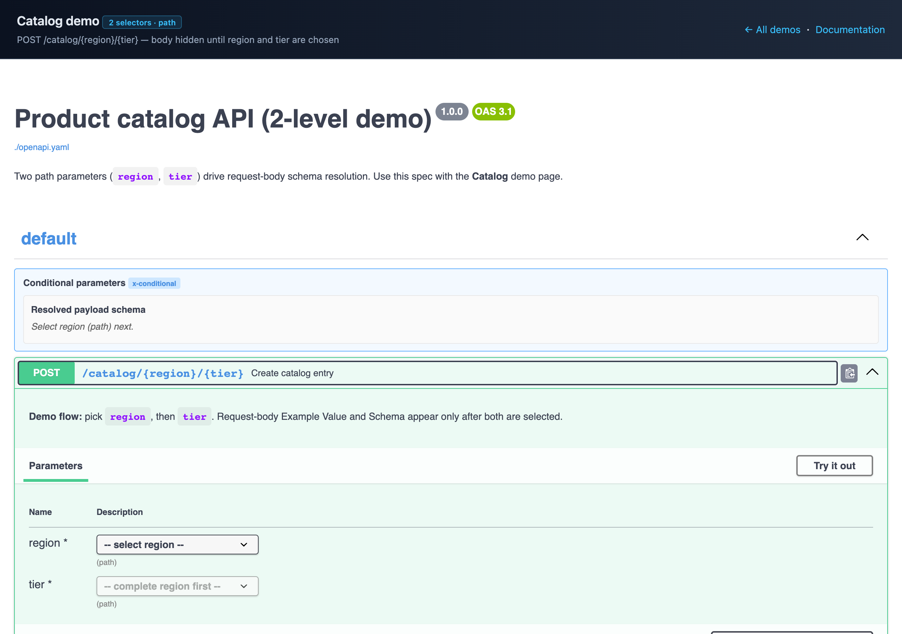
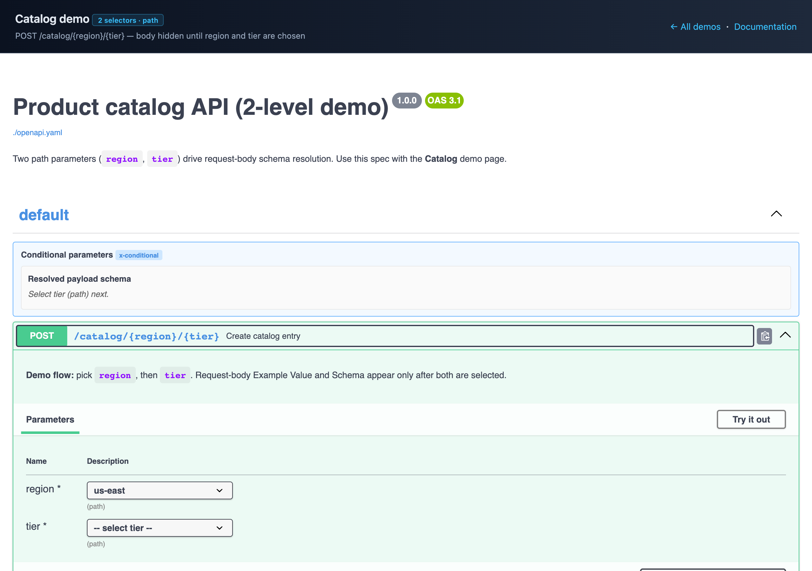
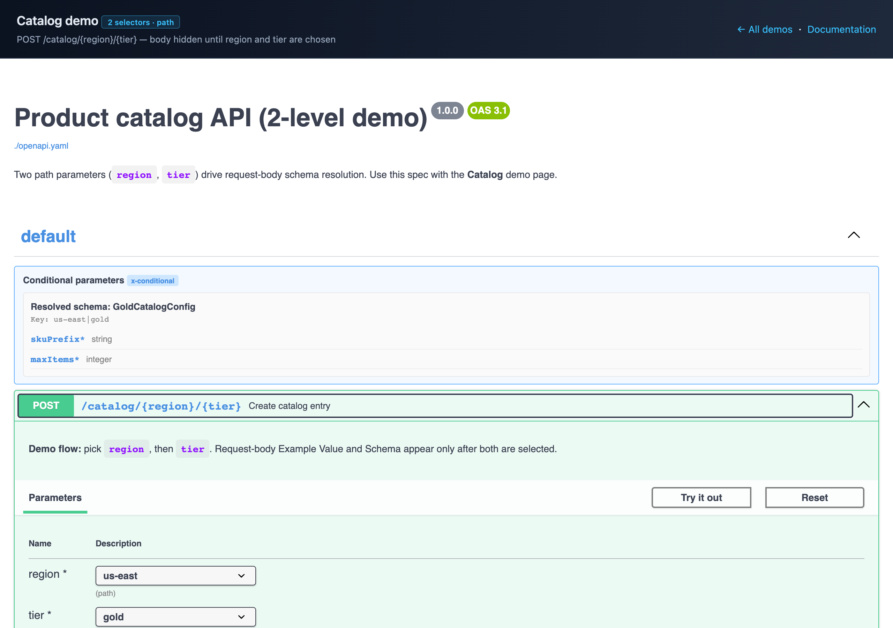
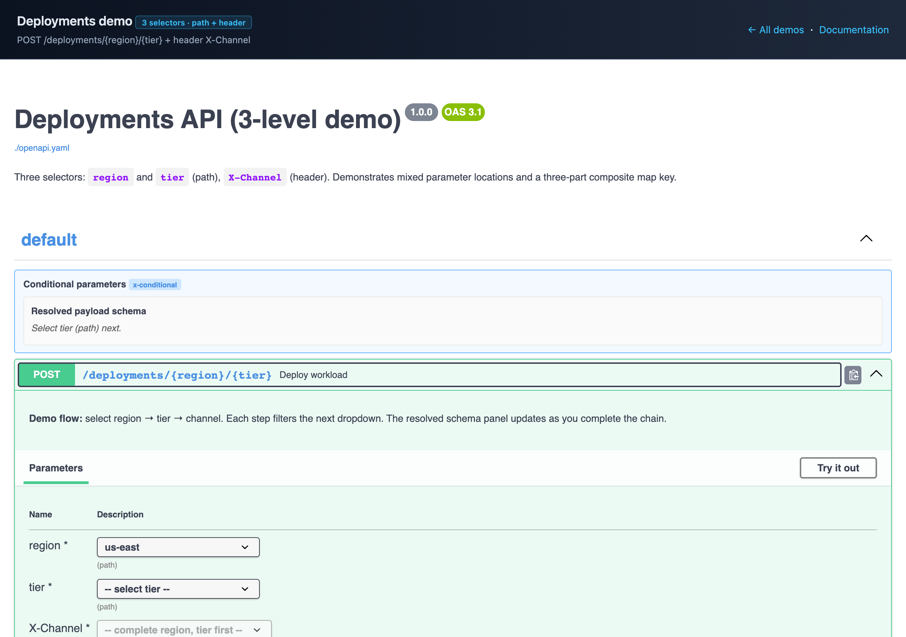
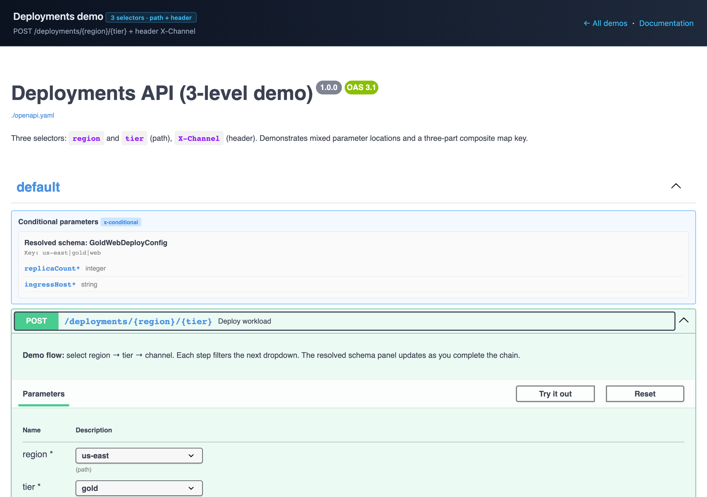

# swagger-ui-generic-conditional-visibility-plugin

[](https://github.com/Dr0na/swagger-ui-generic-conditional-visibility-plugin/actions/workflows/ci.yml)

A **domain-neutral** Swagger UI plugin that drives cascading parameter selectors and optional request-body schema/example resolution from OpenAPI extensions. Use it in any microservice that exposes springdoc/Swagger UI and needs parameters to drive which request-body schema applies.

---

## The problem this plugin solves

Many APIs expose **one operation** whose behaviour depends on a **combination of inputs**—path segments, query flags, headers—and whose **JSON body** is validated against **different DTOs** depending on that combination.

A common OpenAPI pattern is a single request body with `oneOf` over every variant:

```yaml
requestBody:
  content:
    application/json:
      schema:
        oneOf:
          - $ref: "#/components/schemas/ConfigA"
          - $ref: "#/components/schemas/ConfigB"
          - $ref: "#/components/schemas/ConfigC"
```

### What goes wrong in stock Swagger UI

| Issue | What the user sees |
|-------|-------------------|
| **Wrong default example** | Example Value shows the **first** `oneOf` branch (often unrelated to their path/query choices). |
| **Misleading schema** | Schema tab lists “One of” with all variants, not the one that matches the selected parameters. |
| **No cascading UX** | Path/query parameters are independent text fields; nothing enforces “pick A before B” or filters allowed values. |
| **Try it out confusion** | Developers send requests with a body that does not match the parameter combination the server will use to deserialize. |

The server may still validate correctly at runtime (using path params + a custom resolver), but **API explorers lie about the contract**—which slows onboarding, causes bad test payloads, and undermines trust in generated docs.

### What this plugin does

For operations annotated with `x-conditional` and related maps (see [docs/EXTENSION-CONTRACT.md](./docs/EXTENSION-CONTRACT.md)):

1. Renders **ordered dropdowns** for declared parameters (`path`, `query`, or `header`).
2. **Gates** request-body Example Value and Schema until every selector has a value.
3. **Resolves** the body to a single component schema and example from `x-conditional-schema-map` / `x-conditional-example-map`.
4. **Clears** downstream selectors and body when an upstream choice changes.

The plugin is **UI-only**: your microservice still owns validation and binding. OpenAPI extensions document intent for humans and tools; the plugin makes Swagger UI behave accordingly.

### When you need it

- Multi-tenant or multi-region APIs where **path/query/header** chooses the payload shape.
- **Polymorphic onboarding** endpoints (one URL, many device/product configs).
- Any springdoc-backed service where product owners want **accurate Try-it-out** without maintaining a separate wizard.

When you do **not** need it: a single fixed body schema, or parameters that do not change which DTO applies.

---

## Documentation

| Document | Audience | Contents |
|----------|----------|----------|
| [README.md](./README.md) | Everyone | Problem statement, quick start |
| [docs/SPRINGDOC.md](./docs/SPRINGDOC.md) | Spring Boot teams | **Integrate with springdoc in any microservice** |
| [docs/EXTENSION-CONTRACT.md](./docs/EXTENSION-CONTRACT.md) | API authors | OpenAPI extension specification |
| [docs/EXAMPLES.md](./docs/EXAMPLES.md) | API authors | YAML patterns (2-level, header, query, …) |
| [docs/DEMOS.md](./docs/DEMOS.md) | Evaluators | Live demos and screenshots |
| [DEVELOPING.md](./DEVELOPING.md) | Plugin authors | Build, architecture, debug |

---

## Features

- **Any selector depth** — 1 to N parameters in declared order
- **path / query / header** — per-selector `in` in `x-conditional.selectors`
- **Generic extensions** — configurable `x-conditional-*` names, no hard-coded domain prefixes
- **Request body gating** — hide Example/Schema until all selectors are set
- **Resolved schema** — full component schema, not a misleading `oneOf` tree
- **Configurable** — custom extension names, `keyJoin`, `leafKeyOnly`

---

## Quick start (any Swagger UI host)

### 1. Build

```bash
npm run build
```

Output: `dist/generic-conditional-visibility-plugin.js`  
Global: `SwaggerUIGenericConditionalVisibilityPlugin`

### 2. Register

```javascript
window.ui = SwaggerUIBundle({
  url: "/v3/api-docs",
  dom_id: "#swagger-ui",
  plugins: [
    SwaggerUIBundle.plugins.DownloadUrl,
    () => SwaggerUIGenericConditionalVisibilityPlugin(),
  ],
  presets: [SwaggerUIBundle.presets.apis, SwaggerUIBundle.SwaggerUIStandalonePreset],
  layout: "StandaloneLayout",
});
```

### 3. Annotate OpenAPI

```yaml
post:
  x-conditional:
    mode: cascade-bound-body
    selectors:
      - { name: region, in: path }
      - { name: tier, in: path }
  x-conditional-schema-map:
    us-east|gold: GoldConfig
```

Full contract: [docs/EXTENSION-CONTRACT.md](./docs/EXTENSION-CONTRACT.md).

---

## Spring Boot + springdoc (microservices)

Most Java microservices use **springdoc-openapi** for `/v3/api-docs` and embedded Swagger UI.

**Auto-configuration (recommended):** add the Spring Boot starter from `spring-boot-starter/` — it registers the `@Primary` index transformer and bundles the plugin JS. Configure with `swagger.ui.conditional-visibility.enabled` (default `true`).

**Manual setup:** copy the plugin bundle, register a `@Primary` `SwaggerIndexTransformer`, and add `x-conditional` maps via `OpenApiCustomizer`.

**Full guide:** [docs/SPRINGDOC.md](./docs/SPRINGDOC.md)

---

## Live demos (no backend)

```bash
npm run build
npm run demo
```

**Live (GitHub Pages):** [https://dr0na.github.io/swagger-ui-generic-conditional-visibility-plugin/](https://dr0na.github.io/swagger-ui-generic-conditional-visibility-plugin/) — enable once in [Settings → Pages](https://github.com/Dr0na/swagger-ui-generic-conditional-visibility-plugin/settings/pages) (source: **GitHub Actions**); see [docs/PAGES.md](./docs/PAGES.md).

**Local:** [http://localhost:9080/demo/](http://localhost:9080/demo/) (`npm run demo`). Full walkthrough and screenshots: [docs/DEMOS.md](./docs/DEMOS.md).

### Catalog demo (2 selectors)

| No selection (body gated) | Single selector (`region`) | Both selectors (resolved body) |
|:---:|:---:|:---:|
|  |  |  |

### Deployments demo (3 selectors)

| Single (`region`) | Partial (`region` + `tier`) | Complete (all three) |
|:---:|:---:|:---:|
|  |  |  |

Regenerate images: `npm run screenshots` (see [docs/DEMOS.md](./docs/DEMOS.md)).

---

## Repository layout

```
├── src/plugin.js
├── dist/generic-conditional-visibility-plugin.js
├── spring-boot-starter/     # Spring Boot auto-configuration
├── demo/                    # Static Swagger UI demos
├── docs/
│   ├── images/              # Demo screenshots (npm run screenshots)
│   ├── DEMOS.md
│   ├── SPRINGDOC.md         # springdoc integration
│   ├── EXTENSION-CONTRACT.md
│   └── EXAMPLES.md
└── examples/
```

---

## Wiki

Project roadmap, status, and guides: **[GitHub Wiki](https://github.com/Dr0na/swagger-ui-generic-conditional-visibility-plugin/wiki)** (source in [`wiki/`](./wiki/); publish with `npm run wiki:push` after enabling Wikis in repo settings).

## Community

- [Contributing](./CONTRIBUTING.md)
- [Code of conduct](./CODE_OF_CONDUCT.md)
- [Security policy](./SECURITY.md)

## License

Apache-2.0
