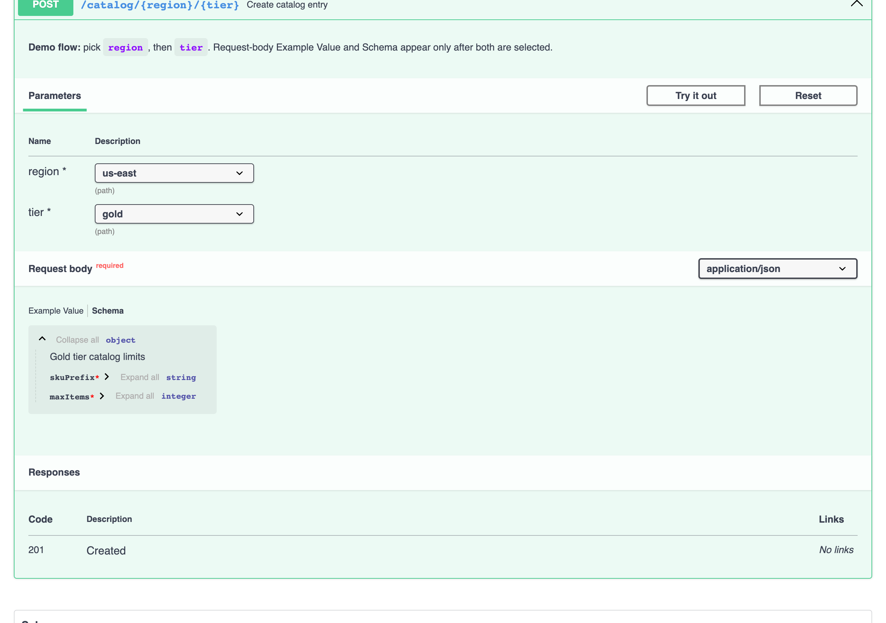

# Live demos (no Spring Boot)

Static HTML demos load Swagger UI from a CDN and this repo’s built plugin. Use them to evaluate behaviour before integrating with springdoc.

## Quick start

```bash
npm run build
npm run demo
```

Open [http://localhost:9080/demo/](http://localhost:9080/demo/) (port **9080**; the repo root redirects to `/demo/`).

`npm run demo` runs `build` then `http-server` at the repository root.

## Demo pages

| Page | URL (after `npm run demo`) | What it shows |
|------|----------------------------|----------------|
| Hub | `/demo/` or `/demo/index.html` | Links to all scenarios |
| Catalog (2-level path) | `/demo/catalog/` | `region` + `tier` path selectors; body gated until both set |
| Deployments (3-level) | `/demo/deployments/` | Two path selectors + `X-Channel` header |

OpenAPI fixtures live beside each demo (`demo/catalog/openapi.yaml`, `demo/deployments/openapi.yaml`).

## Screenshots

Captured from the live demos (regenerate with `npm run screenshots`).

### Catalog demo (2 path selectors)

| State | Screenshot |
|-------|------------|
| No selectors — request body gated |  |
| **Single** selector (`region` only) — tier and body still gated |  |
| **Multi** selector (both chosen) — resolved Example Value |  |
| **Multi** selector — resolved Schema tab |  |

### Deployments demo (path + path + header)

| State | Screenshot |
|-------|------------|
| **Single** selector (`region` only) |  |
| **Partial** multi (`region` + `tier`; header still required) |  |
| **Complete** (all three selectors) |  |

## How demos load the plugin

Each scenario page includes:

- Swagger UI bundle from unpkg (`BaseLayout` — no extra preset script required)
- `dist/generic-conditional-visibility-plugin.js` (run `npm run build` first)
- `demo/shared/swagger-init.js`, which registers `SwaggerUIGenericConditionalVisibilityPlugin` in the Swagger UI `plugins` array

This mirrors springdoc integration (register the factory in `plugins`) but without Spring Boot. For production microservices, follow [SPRINGDOC.md](./SPRINGDOC.md).

### Styling note

Scenario pages use a **dark demo header** and a **light Swagger UI panel** (`demo/shared/demo.css`). Swagger UI and the plugin are designed for light backgrounds; isolating `#swagger-ui` avoids inherited dark-theme text and OS `prefers-color-scheme` clashes.

## Regenerating screenshots

```bash
npm run screenshots
```

Starts a temporary static server on port **9081** (or set `DEMO_BASE_URL` if you already ran `npm run demo`). Requires `playwright` (`npm install` installs it as a dev dependency) and Chromium (`npx playwright install chromium` once).
